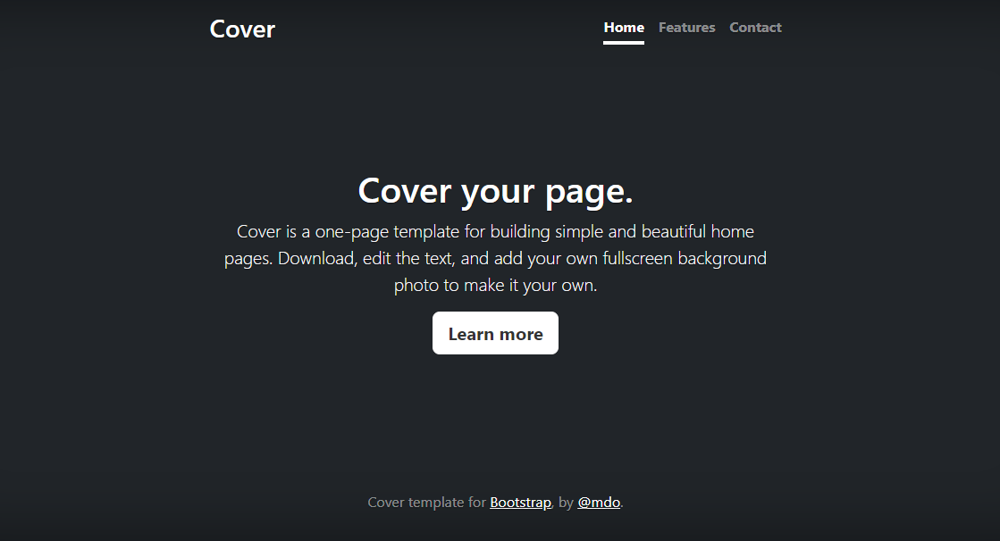

* [Projeto de potifólio pessoal](#Projeto-de-portifolio-pessoal)  
* [Descrição](#descrição)  
* [Introdução](#introdução)  
* [Funcionalidades](#funcionalidades)  
* [Tecologias utilizadas](#tecologias-utilizadas)  
* [Fontes consultadas](#fontes-consultadas)  
* [Autores](#autores)  

# 📖Portfolio-pessoal

Projeto criado utilizando exemplo do bootstrap para ensino de uso do README e do bootstrap
#### 💻Capa do projeto

## 📄Descrição 

## ✔️Introdução

## 👾Funcionalidades

### 🤖Tecologias utilizadas

## 🔗Fontes consultadas

## ✒️Autores
